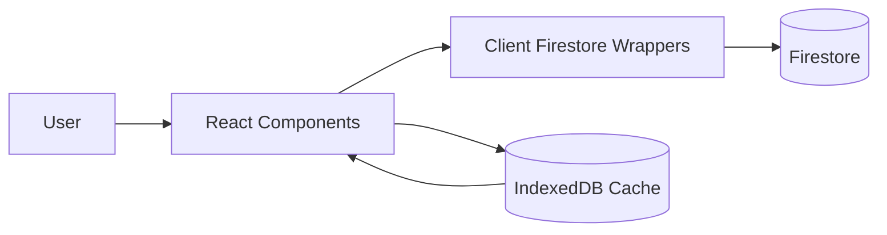
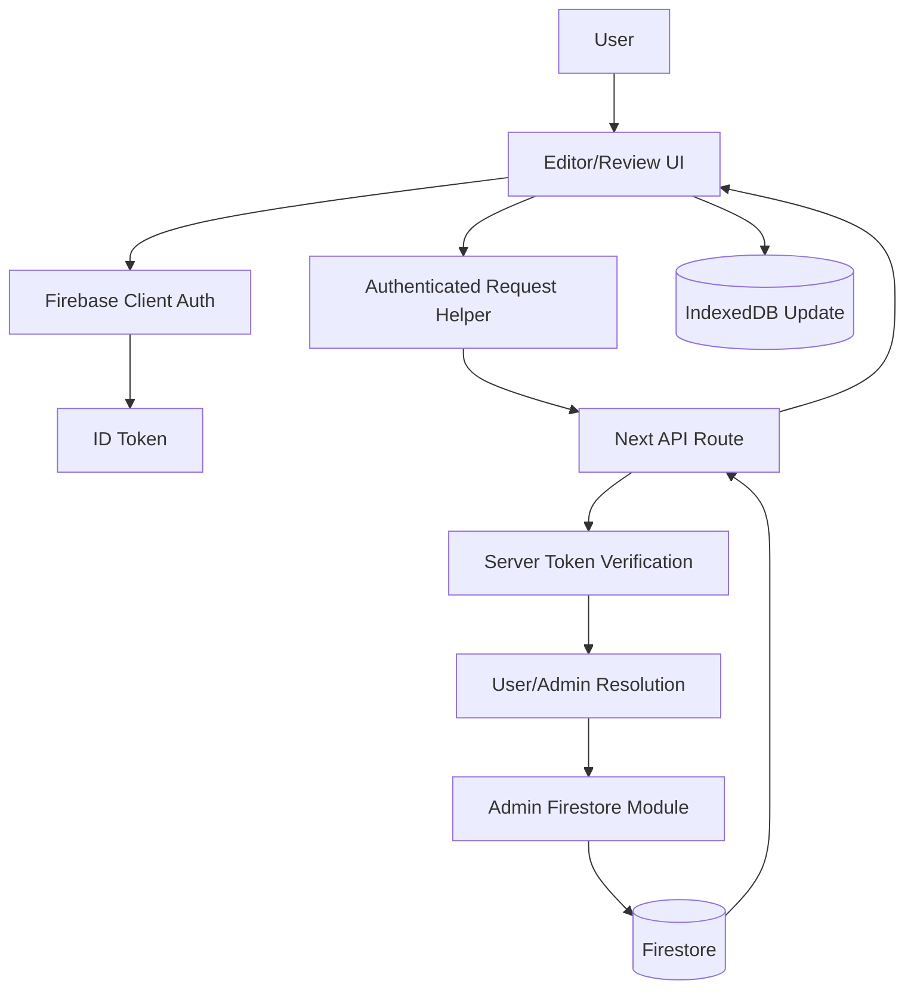

# Architecture Overview

This document summarizes the current runtime architecture, trust boundaries, and module ownership for the DevTyping codebase.

## System Summary

* Framework: Next.js App Router (React + TypeScript)
* Primary data platform: Firebase (Auth + Firestore)
* Security posture: privileged writes are server-mediated through API routes and Firebase Admin SDK
* Local UX acceleration: IndexedDB caching for exercise state

## High-Level Module Layout

* App routes and route handlers: `src/app`
* Reusable UI components: `src/components`
* Shared constants/interfaces/utilities: `src/lib/constants`, `src/lib/interfaces`
* Client-side Firebase data/auth wrappers: `src/lib/data/firebase`
* Local cache abstraction: `src/lib/data/indexeddb`
* Server-only auth/admin Firestore modules: `src/lib/server`

## Runtime Trust Boundaries

1. Browser/client is untrusted for privileged writes.
2. Client sends authenticated requests with Firebase ID token.
3. Next.js API routes verify token and resolve server-side authorization.
4. Server-only admin modules perform writes with Firebase Admin SDK.
5. Firestore rules provide an additional enforcement layer.

## Request Flows

### 1) Read Path (Client-Focused)

Notes:

* Read-oriented interactions prioritize responsiveness and can use local cache.
* Typed wrappers in `src/lib/data/firebase/firestore/*` normalize data access patterns.

### 2) Privileged Write Path (Server-Mediated)

Notes:

* This path is used for topic creation, exercise creation, and exercise status toggles.
* Server modules centralize authorization checks and write semantics.

## Core Responsibilities by Folder

### `src/app`

* Defines pages (home, contribute, topics, review) and API route handlers.
* API handlers are the entry point for privileged mutations.

### `src/components`

* UI composition and interaction logic.
* Auth-aware presentation wrappers (e.g., protected render behavior).
* Editor flow components for selecting samples and publishing/toggling summaries.

### `src/lib/data/firebase`

* Client-side wrappers for Firebase auth and Firestore access.
* Shared helper methods for typed reads and non-privileged data calls.

### `src/lib/server`

* Server-only Firebase Admin initialization.
* Token verification, user lookup, and authorization utilities.
* Privileged Firestore write operations used by API routes.

### `src/lib/data/indexeddb`

* Local persistence and cache synchronization for exercise state.
* Supports responsive UX and state continuity.

## Security Model in Practice

* Authentication: Firebase ID token acquired client-side.
* Authorization: validated server-side before privileged writes.
* Persistence controls: Firestore security rules in `firestore.rules`.
* Defense-in-depth: route-level checks + server admin module checks + Firestore rules.

## Data Contracts

* Primary shared interfaces live in `src/lib/interfaces`.
* Firestore wrappers consume these interfaces to enforce compile-time shape consistency.

## Quality and Delivery

* Scripts in `package.json` provide `lint`, `typecheck`, `test`, `build`, and `test:e2e`.
* CI workflow in `.github/workflows/ci.yml` enforces these checks on Node 22.x.

## Known Operational Dependencies

* Firebase client configuration environment variables for app runtime.
* Server/admin credentials for API-route privileged operations.
* Firestore rules deployment aligned with application authorization expectations.

## Change Safety Guidelines

* Keep new privileged mutations behind server route handlers.
* Avoid direct client writes for operations requiring role-based authorization.
* Preserve clear separation between client wrappers (`src/lib/data`) and server admin code (`src/lib/server`).
* Update this document when introducing new mutation endpoints or trust boundaries.
